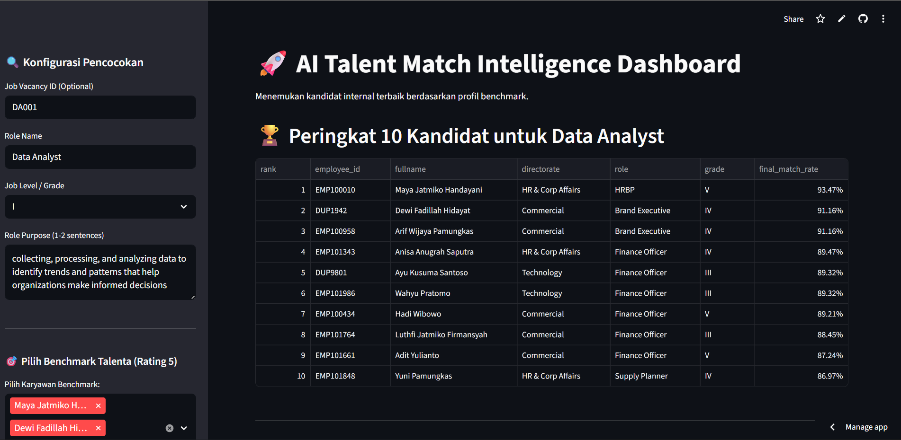
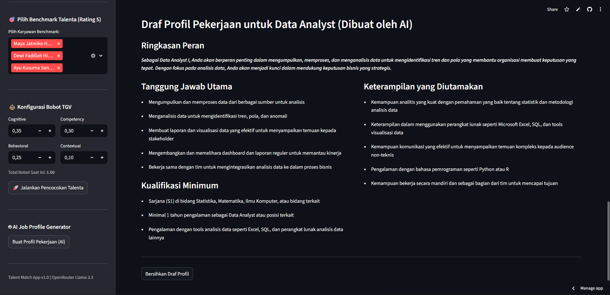
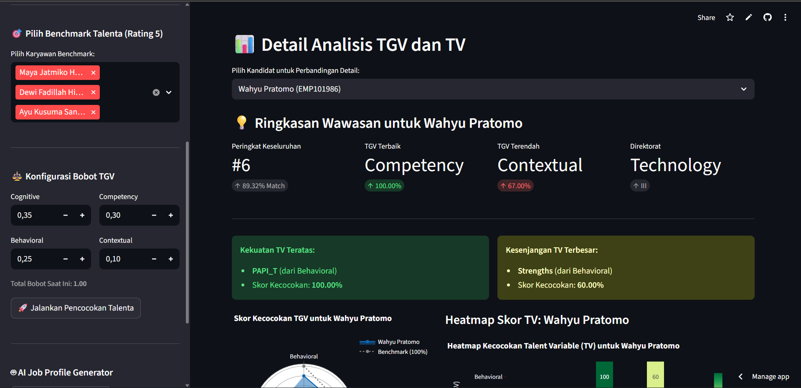
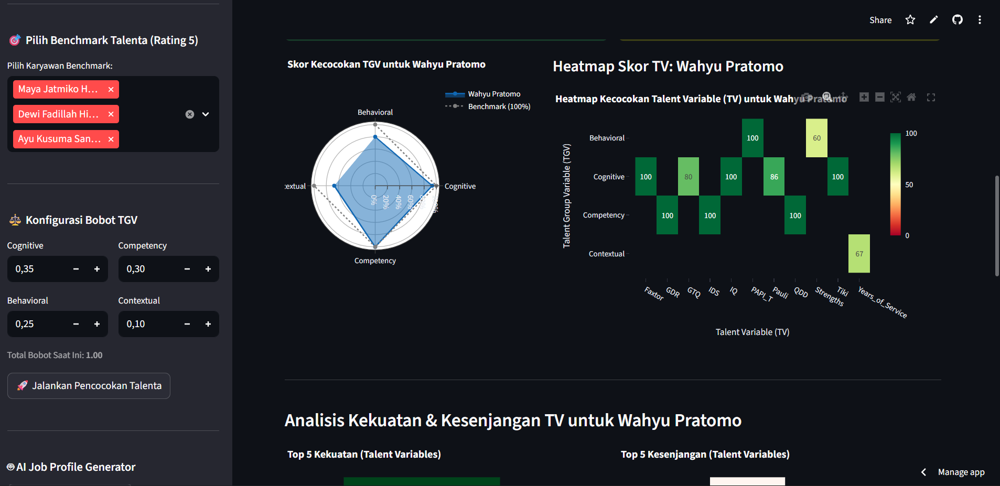
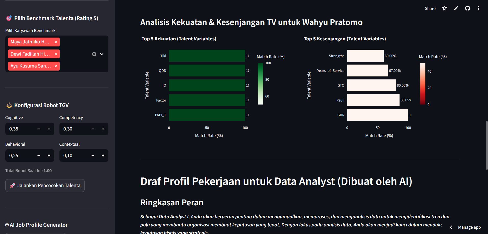

# Case Study: Sistem Intelijen Pencocokan Talenta (Talent Match Intelligence System) 
**Repositori ini berisi solusi lengkap untuk Studi Kasus Data Analyst 2025, yang berfokus pada perancangan dan implementasi sistem Talent Match Intelligence dari awal hingga akhir.**

Tautan Aplikasi yang Telah Di-deploy: https://ai-talent-dashboard.streamlit.app/

## 1. Latar Belakang Proyek
Proyek ini menyimulasikan alur kerja analisis data di Perusahaan X untuk membangun sebuah Talent Match Intelligence system. Tujuannya adalah untuk membantu para pemimpin bisnis membuat keputusan suksesi yang lebih baik dengan:
1.	Menemukan Pola Sukses: Menganalisis data karyawan untuk mengidentifikasi apa yang membuat karyawan berkinerja tinggi (rating 5) sukses.
2.	Merumuskan Logika: Menerjemahkan pola-pola tersebut ke dalam logika SQL yang dapat menghitung skor kecocokan (match score).
3.	Membangun Aplikasi: Menyajikan wawasan melalui aplikasi dasbor bertenaga AI yang interaktif.

## 2. Alur Kerja Proyek & Metodologi
Solusi ini dibagi menjadi tiga tahap utama sesuai dengan brief studi kasus:

### Tahap 1: Penemuan Pola Sukses (Success Pattern Discovery)

 * Tujuan: Mengidentifikasi faktor pembeda (driver) karyawan dengan rating kinerja 5.
 *  Proses:
    * Melakukan Analisis Data Eksploratif (EDA) pada berbagai set data, termasuk:
        * Pilar Kompetensi (competencies_yearly).
        * Profil Psikometri (papi_scores, profiles_psych).
        * Data Perilaku (strengths).
        * Faktor Kontekstual (jabatan, masa kerja, pendidikan, dll.).
* Menggunakan visualisasi seperti heatmaps, radar charts, dan correlation plots untuk mengkomunikasikan temuan.
* Mensintesis temuan ini menjadi "Success Formula" yang dapat dijelaskan, yang mendefinisikan Talent Group Variables (TGV) dan Talent Variables (TV) yang paling penting.

### Tahap 2: Operasionalisasi Logika dalam SQL
 * Tujuan: Menerjemahkan Success Formula menjadi kueri SQL yang dapat menghitung skor kecocokan untuk semua karyawan terhadap benchmark yang dipilih.
 *  Proses:
    * Merancang kueri SQL modular menggunakan Common Table Expressions (CTEs) di Postgres (Supabase).
    * Logika Perhitungan:
        * Baseline Aggregation: Menghitung skor baseline (median) dari talenta benchmark yang dipilih.
        * TV Match Rate: Menghitung kecocokan per variabel (TV), menangani logika numerik (rasio) dan kategorikal (boolean).
        * TGV Match Rate: Mengagregasi skor TV menjadi skor grup (TGV).
        * Final Match Rate: Menghitung rata-rata tertimbang akhir dari semua TGV.
* Kueri ini menghasilkan tabel output terperinci seperti yang diminta.

### Tahap 3: Aplikasi AI Talent & Dasbor
* Tujuan: Mengubah data hasil SQL menjadi wawasan yang dapat ditindaklanjuti (actionable) melalui aplikasi yang dinamis dan bertenaga AI.
    * Proses:
      * Membangun aplikasi web menggunakan Streamlit.
      * Aplikasi ini tidak statis; ia mengambil input pengguna secara real-time (Nama Peran, Level Pekerjaan, ID Karyawan Benchmark).
      * Integrasi AI (LLM): Menggunakan API LLM (seperti OpenRouter) untuk secara otomatis menghasilkan Deskripsi Pekerjaan, Persyaratan, dan Kompetensi Kunci berdasarkan input pengguna.
      * Visualisasi Dasbor: Saat input baru diserahkan, aplikasi akan menjalankan ulang kueri SQL yang diparameterisasi  dan menyajikan:
        * Profil Pekerjaan (AI-Generated): Teks yang dihasilkan oleh LLM.
        * Peringkat Talenta (Ranked Talent List): Tabel karyawan yang dapat diurutkan berdasarkan final_match_rate.
        * Visualisasi Wawasan: Grafik interaktif yang menunjukkan distribusi skor, kekuatan & kelemahan TGV teratas, dan perbandingan kandidat vs. benchmark.

## 3. Tumpukan Teknologi (Technology Stack)
Berikut adalah alat dan platform yang digunakan dalam proyek ini
| Kategori               | Alat/Platform          | Kegunaan                                                     |
| ---------------------- | -----------------------| -------------------------------------------------------------|
| Database               | Postgres               | Penyimpanan data dan eksekusi logika SQL.                    |
| Analisis & Kueri       | Python (Pandas) & SQL  | Untuk EDA, penemuan pola, dan algoritma pencocokan.          |
| Aplikasi & Visualisasi | Streamlit              | Untuk membangun dan men-deploy dasbor wawasan interaktif.    |
| Model AI               | OpenRouter (LLM)       | Untuk menghasilkan deskripsi pekerjaan dan profil kompetensi.|
| Version Control        | GitHub                 | Untuk manajemen kode sumber dan dokumentasi.                 | 


## 4. Skema Database (ERD)
Analisis dan kueri didasarkan pada skema database yang disediakan, yang mencakup data organisasi, kinerja, kompetensi, dan psikometri.
!


## 5. Cara Menjalankan Proyek Ini Secara Lokal
  Petunjuk ini akan membantu Anda menjalankan aplikasi Streamlit di mesin lokal Anda.
  Prasyarat :
    * Python 3.8+
    * Akses ke database Supabase (Postgres) yang telah diisi dengan data.
    * API Key untuk layanan LLM (misalnya, OpenRouter).

  ###  Langkah-langkah Instalasi
  1. Clone Repositori:
      ```bash
        git clone https://github.com/Intexcloud/Ai-Talent-Dashboard.git
        cd Ai-Talent-Dashboard
      ```
  2. Buat Lingkungan Virtual (Virtual Environment):
      ```bash
        python -m venv venv
        source venv/bin/activate  # Di Windows, gunakan: venv\Scripts\activate
      ```
  3. Instal Dependensi: File requirements.txt berisi semua library Python yang diperlukan (seperti Streamlit, Pandas, psycopg2, dll.).
      ```bash
          pip install -r requirements.txt
      ```
  4. Siapkan Environment Variables: Buat file .env di direktori root proyek.
     File ini akan menyimpan kredensial rahasia Anda. (Streamlit juga dapat menggunakan fitur Secrets Management bawaannya jika di-deploy).
       ```Ini.TOML
          # .env
          DB_HOST="[HOST_SUPABASE_ANDA]"
          DB_PORT="[PORT_ANDA]"
          DB_NAME="postgres"
          DB_USER="postgres"
          DB_PASS="[PASSWORD_DATABASE_ANDA]"
          OPENROUTER_API_KEY="[API_KEY_OPENROUTER_ANDA]"
       ```
  5. Jalankan Aplikasi
      ```bash
          streamlit run main.py
      ```
Buka http://localhost:8501 di browser Anda untuk melihat aplikasi beraksi.


## 6. Contoh Tampilan Aplikasi

Berikut adalah beberapa tangkapan layar dari aplikasi dashboard akhir:
  * Halaman Input Pengguna & Pembuatan AI:
      
      

  * Dasbor Peringkat Talenta & Visualisasi:
    
    

  * Analisa Detail Kandidat (Contoh Radar Chart):
    

