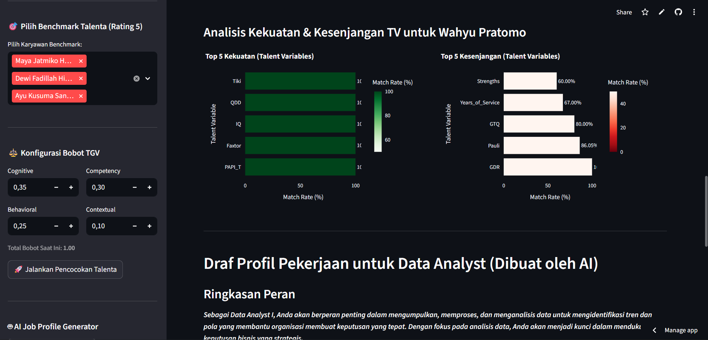
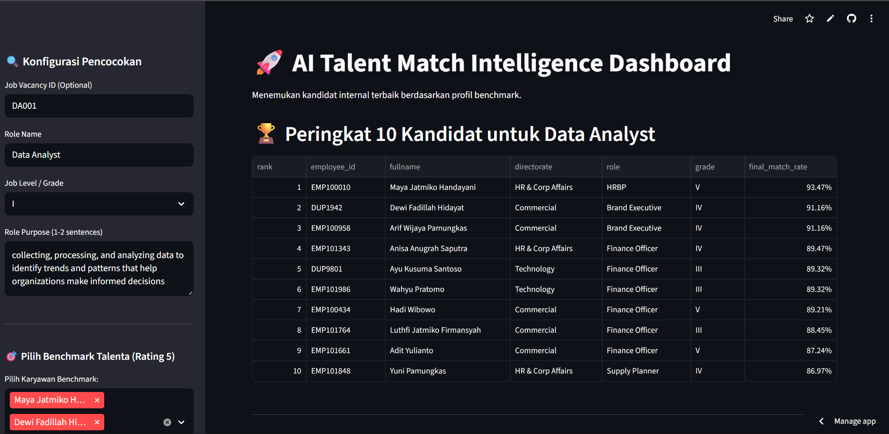
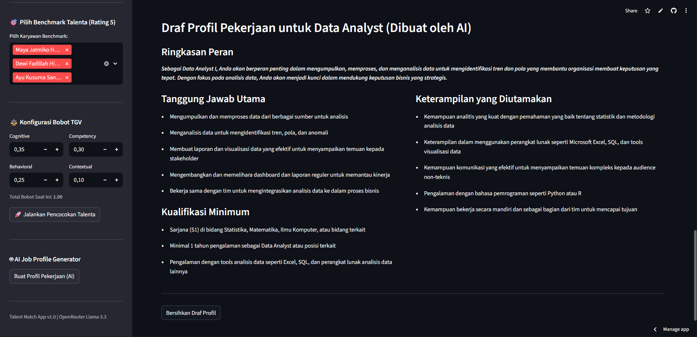
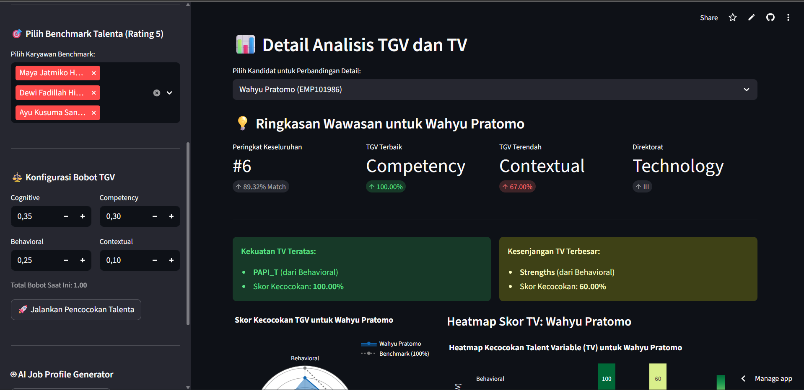
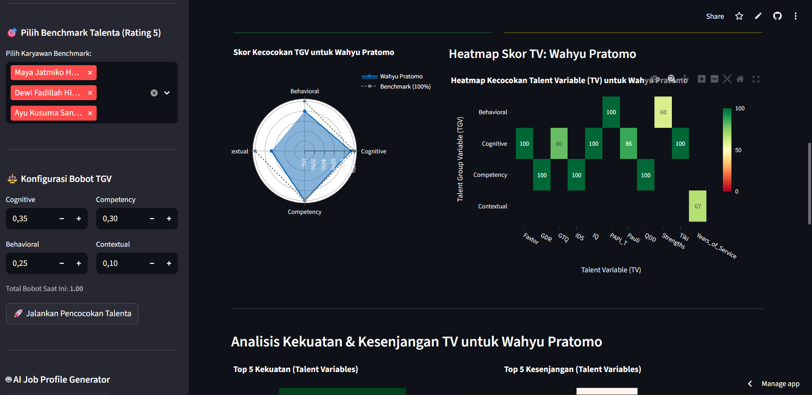

# Case Study: Talent Match Intelligence System
**This repository contains the complete solution for the 2025 Data Analyst Case Study, focusing on the end-to-end design and implementation of a Talent Match Intelligence system.**

Deployed Application Link: [https://ai-talent-match-intelligence.streamlit.app/](https://ai-talent-match-intelligence.streamlit.app/)

---

## 1. Project Background
This project simulates the data analysis workflow at Company X to build a Talent Match Intelligence system. The objective is to assist business leaders in making better succession decisions by:
1.  **Identifying Success Patterns:** Analyzing employee data to identify the traits and drivers of high-performing employees (rating 5).
2.  **Formulating Logic:** Translating these patterns into SQL logic capable of calculating a "match score."
3.  **Building the Application:** Presenting insights through an interactive, AI-powered dashboard application.

## 2. Project Workflow & Methodology
The solution is divided into three main stages as per the case study brief:

### Phase 1: Success Pattern Discovery
*   **Goal:** Identify the differentiating factors (drivers) of employees with a performance rating of 5.
*   **Process:**
    *   Conduct Exploratory Data Analysis (EDA) on various datasets, including:
        *   Competency Pillars (`competencies_yearly`).
        *   Psychometric Profiles (`papi_scores`, `profiles_psych`).
        *   Behavioral Data (`strengths`).
        *   Contextual Factors (job title, tenure, education, etc.).
    *   Use visualizations such as heatmaps, radar charts, and correlation plots to communicate findings.
    *   Synthesize these findings into an explainable "Success Formula," defining the most critical Talent Group Variables (TGV) and Talent Variables (TV).

### Phase 2: Operationalizing Logic in SQL
*   **Goal:** Translate the Success Formula into SQL queries to calculate match scores for all employees against a selected benchmark.
*   **Process:**
    *   Design modular SQL queries using Common Table Expressions (CTEs) in Postgres (Supabase).
    *   **Calculation Logic:**
        *   *Baseline Aggregation:* Calculate baseline scores (median) from the selected benchmark talent.
        *   *TV Match Rate:* Calculate matches per variable (TV), handling numerical (ratio) and categorical (boolean) logic.
        *   *TGV Match Rate:* Aggregate TV scores into group scores (TGV).
        *   *Final Match Rate:* Calculate the final weighted average of all TGVs.
*   The query generates a detailed output table as requested.

### Phase 3: AI Talent App & Dashboard
*   **Goal:** Transform SQL results into actionable insights via a dynamic, AI-powered application.
*   **Process:**
    *   Build a web application using Streamlit.
    *   The app is non-static; it captures real-time user inputs (Role Name, Job Level, Benchmark Employee ID).
    *   **AI Integration (LLM):** Utilize LLM APIs (such as OpenRouter) to automatically generate Job Descriptions, Requirements, and Key Competencies based on user input.
    *   **Dashboard Visualization:** When new input is submitted, the app reruns parameterized SQL queries and displays:
        *   *Job Profile (AI-Generated):* Text generated by the LLM.
        *   *Ranked Talent List:* A table of employees sortable by `final_match_rate`.
        *   *Insight Visualizations:* Interactive charts showing score distribution, top TGV strengths & weaknesses, and candidate vs. benchmark comparisons.

---

## 3. Technology Stack
The following tools and platforms were used in this project:

| Category               | Tool/Platform           | Purpose                                                         |
| :--------------------- | :---------------------- | :-------------------------------------------------------------- |
| **Database**           | Postgres                | Data storage and SQL logic execution.                           |
| **Analysis & Querying**| Python (Pandas) & SQL   | For EDA, pattern discovery, and matching algorithms.            |
| **App & Visualization**| Streamlit               | To build and deploy the interactive insight dashboard.          |
| **AI Model**           | OpenRouter (LLM)        | To generate job descriptions and competency profiles.           |
| **Version Control**    | GitHub                  | For source code management and documentation.                   |

---

## 4. Database Schema (ERD)
The analysis and queries are based on the provided database schema, which includes organizational data, performance, competencies, and psychometrics.


---

## 5. How to Run This Project Locally
These instructions will help you run the Streamlit application on your local machine.

### Prerequisites:
*   Python 3.8+
*   Access to a Supabase (Postgres) database populated with data.
*   API Key for an LLM service (e.g., OpenRouter).

### Installation Steps:
1.  **Clone the Repository:**
    ```bash
    git clone [https://github.com/Intexcloud/Ai-Talent-Dashboard.git](https://github.com/Intexcloud/Ai-Talent-Dashboard.git)
    cd Ai-Talent-Dashboard
    ```
2.  **Create a Virtual Environment:**
    ```bash
    python -m venv venv
    source venv/bin/activate  # On Windows, use: venv\Scripts\activate
    ```
3.  **Install Dependencies:**
    ```bash
    pip install -r requirements.txt
    ```
4.  **Set Up Environment Variables:** Create a `.env` file in the project root directory to store your credentials.
    ```toml
    # .env
    DB_HOST="[YOUR_SUPABASE_HOST]"
    DB_PORT="[YOUR_PORT]"
    DB_NAME="postgres"
    DB_USER="postgres"
    DB_PASS="[YOUR_DATABASE_PASSWORD]"
    OPENROUTER_API_KEY="[YOUR_OPENROUTER_API_KEY]"
    ```
5.  **Run the Application:**
    ```bash
    streamlit run main.py
    ```
    ### open [http://localhost:8501](http://localhost:8501) in your browser to see the application in action.
    
*   **Candidate Gap Analysis:**
    *   
* User Input & AI Generation Page:
     * 
     * 
* Talent Ranking Dashboard & Visualization:
    * 
    * 
